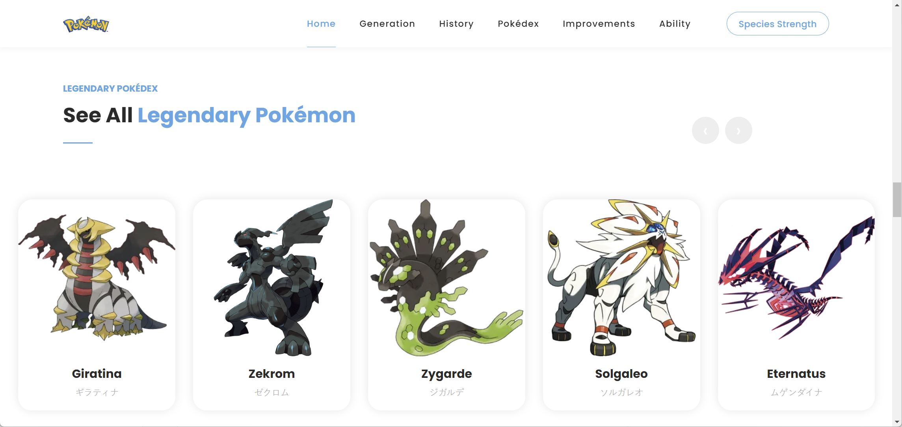

# Legendary Pokémon Pokédex
[Original Template](https://themewagon.github.io/digimedia/homepage_3.html)

## How to Open This Website:
To visit the website, download the folder and open the index.html😊

## Website Introduction
- [Website Topic Description](#website-topic-description)
- [How to Visualize this Website](#how-to-visualize-this-website)

## Website Topic Description
This is a website for Legendary Pokémon Pokédex. 
What is Pokémon:
- Pokémon is one of the most worldwide famous IP(Intellectual Property), it originated in 1996, and has continuously brought people new experiences in these years, and the products provide by this brand have also won the love of most people. 

Why chose this topic:
- When I was in elementary school, Pokémon games were already one of the most popular games. At that time, the Internet was not as developed as it is now, so this game brought me a lot of fun at that time.

## How to Visualize this Website:
- [Header Section](#header-section)
- [Generation Section](#generation-section)
- [History Section](#history-section)
- [Pokédex Section](#pokédex-section)
- [Strength Section](#strength-section)
- [Ability Section](#ability-section)
- [Footer Section](#footer-section)

### Header Section:
The Header section contain two parts, the nav bar, and carousel. 
 
Overview for the nav bar and carousel
 

The Nav bar will alway at the top of the page, wherever you are, and when click on the tage, you will be lead to the corresponding section.
 
Nav bar on the top when in Generation Section
 

The responsive style of the Nav bar. 

Nav bar responsive style
 

### Generation Section:
Generation section introduce the Pokémon generation from 1 - 9, with some interactive button and image to show the story.
  
The generation section have two parts, the above button can be clicked to switch different generation, and the blow container will show the content. 
 
The overview of the generation section
 

There is a Nav tab in the first generation, it allows user to switch the content. 
 
The Nav tab on the generation container
 

### History Section:
History section introduce the Pokémon game history, it includes the game release time and story.
  
The history section have two parts, the left part will allow user see the video of Pokémon history, and right part use Tooltips to let user better see the Pokémon game history. 

History section overview
 

The video all user better know the history of Pokémon. 
 
The history section video modal
 

The Tooltips will give user more information. 
 
The history section Tooltips feature
 

### Pokédex Section:
Pokédex section use scroll section to show all the legendary Pokémon from first generation to ninth generation.
  
Hover on the card will zoom up the card, and click on it will show the Pokémon detail.
 
Pokédex Section overview
 

Hover on the card will zoom up it(#the click function will introduce in the next section).
 
Pokédex Section hover card
 

### Strength Section:
Strength section use table to show legendary Pokémon, with modal to show more detail.
  

Strength Section overview
 

Click more to see more detail.

Strength Section overview
 

### Ability Section:
Ability section use chart to show all the legendary Pokémon ability and make it easy to compare.
  
Click more to see more detail.

Ability overview
 

### Footer Section:
Ability section give user choice to leave commit to this website.
 

Footer overview
 

Validation on leave commit.

Feedback validation
 

Successfully leave commit notification.

Feedback notification
 

Successfully leave commit notification.

Feedback responsive
 
